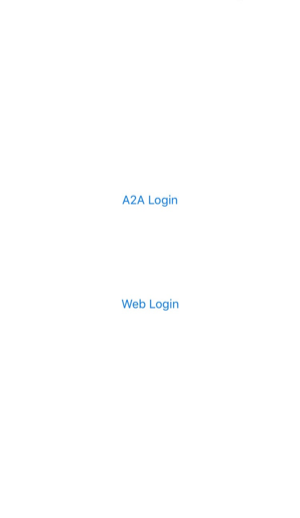

# line-ios-v2-starter
LINE iOS SDK V2 starter

# Introduction

This is a sample application for LINE iOS SDK V2. It demonstrates the following functionality:

* App-to-app Login
* Web Login
* GetProfile API
* Verify Token API
* Refresh Token API
* Logout API

It includes a sample in Objective-C and a sample in Swift.

# Before Starting

* You must have Xcode installed.
* You must have [Cocoapods](https://cocoapods.org/) installed.
* You must create a LINE Login account on the [LINE Business Center](https://business.line.me) that has the application type set to `NATIVE_APP`. You will need the account's Channel ID to set up the SDK.

# Setup

1. Run `pod install` from the `LineSDKStarterObjC` folder if you want to use the Objective-C sample or from the `LineSDKStarterSwift` folder if you want to use the Swift sample.
2. Set the iOS bundle ID and iOS scheme in the technical configuration section of the Channel Console.
3. Set the LineSDKConfig/ChannelID element in the project's `Info.plist` to your channel's Channel ID and then build the application using Xcode.

# How to Use

<kbd></kbd>

The **Login with LINE** button will use the LINE app to log in and the **Browser Login** button will open a Web Login screen inside of a Safari Web View and prompt
the user to log in using their LINE account's email and password.

After logging in, the user's profile information and access token will be displayed on the screen in addition to four buttons:

* **Get Profile** - Pushing this button will call the LINE SDK's `getProfileWithCompletion` method. The profile information retrieved from the API will appear in a different view.
This information should be the same as the profile information that is initially displayed to the user after they log into this starter application.
* **Verify Token** - Pushing this button will call the LINE SDK's `verifyTokenWithCompletion` method. An alert pop-up will display informing the user if their token is valid or not.
* **Refresh Token** - Pushing this button will call the LINE SDK's `refreshTokenWithCompletion` method. This will update the access token that is displayed on the starter app's main screen.
* **Logout** - Pushing this button will call the LINE SDK's `logoutWithCompletion` method. This will revoke the access token and return the user to the "Select Login" page.

# Documentation

For detailed documentation, please refer to the following links:

* [iOS SDK documentation](https://developers.line.me/ios/overview)
* [LINE SDK for iOS API reference](https://devdocs.line.me/en/#line-sdk-for-ios-api-reference)
